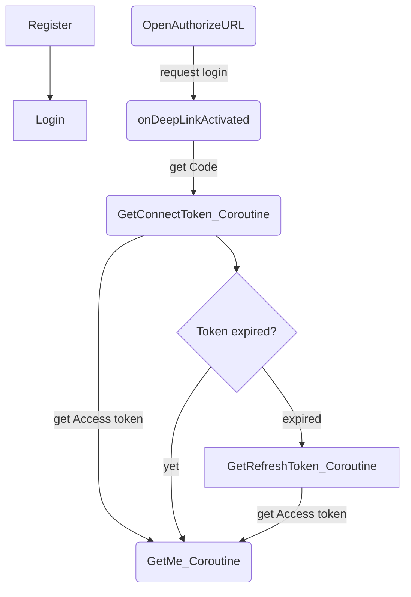
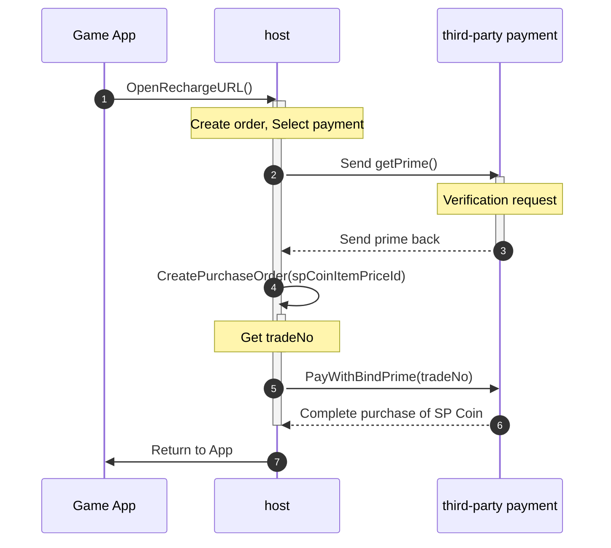
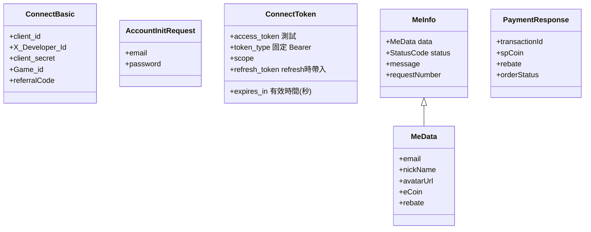

# 17dame Connect Tool for Android 
17dame connect tool: ConnectTool provides registration, login, Authorize,get access token, refresh token and user information. 
## Table of Contents 
- [Installation](#installation) 
- [Setting](#setting)
- [Authorize Flow](#operating)
- [ConnectTool function](#function) 
    - [SendRegisterData](#SendRegisterData)
    - [SendLoginData](#SendLoginData)
    - [OpenAuthorizeURL](#OpenAuthorizeURL)
    - [GetConnectToken_Coroutine](#GetConnectToken-Coroutine)
    - [GetRefreshToken_Coroutine](#GetRefreshToken-Coroutine)
- [Payment Flow](#PaymentFlow) 
- [Payment function](#PaymentFunction)
    - [Open Recharge page](#Open-Recharge-page) 
    - [Call Open ConsumeSP page](#OpenConsumeSPpage) 
- [Model](#model) 

## Prerequisites
### Minimum SDK
Your application needs to support minimum SDK version 26. 

## Installation
- Downliad libary:[connecttool-v1.3.1.aar](https://github.com/jianweiCiou/com.17dame.connecttool_android/blob/main/Tutorial/connecttool-v1.3.1.aar)
- Connect Tool AAR Tutorial-v1.3.1.pdf (for Payment): [View](https://github.com/jianweiCiou/com.17dame.connecttool_android/blob/main/Tutorial/Connect%20Tool%20AAR%20Tutorial-v1.3.1.pdf)

- Downliad libary:[connecttool-v1.0.0.aar](https://github.com/jianweiCiou/com.17dame.connecttool_android/blob/main/Tutorial/connecttool-v1.0.0.aar)
- Connect Tool AAR Tutorial-v1.0.0.pdf (for Authorize): [View](https://github.com/jianweiCiou/com.17dame.connecttool_android/blob/main/Tutorial/Connect%20Tool%20AAR%20Tutorial-v1.0.0.pdf)
  
## Setting
- Open \app\src\main\AndroidManifest.xml to add:
```xml
<uses-permission android:name="android.permission.INTERNET" />
``` 
```xml
<intent-filter>
  <action android:name="android.intent.action.VIEW" />
  <category android:name="android.intent.category.DEFAULT" />
  <category android:name="android.intent.category.BROWSABLE" />
  <data android:scheme="{{ Get from redirect_uri's scheme }}" android:host="connectlink" />
</intent-filter>
```  
- redirect_uri : Set the name of the scene to be opened, for example `{{ Get from redirect_uri's scheme }}://connectlink?connectscene`
 
- Add implementation to build.gradle : 
```txt
dependencies { 
   ...
    // post request
    implementation 'com.squareup.retrofit2:retrofit:2.1.0'
    implementation 'com.squareup.retrofit2:converter-gson:2.1.0'
    implementation 'com.squareup.okhttp3:logging-interceptor:3.4.1'
    implementation 'com.squareup.okhttp3:okhttp:3.4.1'

    implementation(project(":connecttool"))
}
```

## Authorize Flow
Here is a simple flow chart:

 
Send Authorize to get access_token and get code:
```java 
Intent appLinkIntent = getIntent();
String appLinkAction = appLinkIntent.getAction();
Uri appLinkData = appLinkIntent.getData(); 
if (appLinkData != null && appLinkData.isHierarchical()) {
 String uri = this.getIntent().getDataString();
 _connectTool.code = appLinkData.getQueryParameter("code");
}
```


## ConnectTool function
- Create `ConnectTool` and `ConnectTool.ConnectBasic`, parameters must be filled in:
```csharp
_connectTool = new ConnectTool(
  this,
  state,
  requestNumber,
  redirect_uri,
  RSAstr
); 
_connectTool.connectBasic = new ConnectBasic()
{
    client_id,
    X_Developer_Id,
    client_secret,
    Game_id,
    referralCode,
};
```
- state : Please fill in what you want to verify,`state` can be query through redirect_uri.
- requestNumber :The identification generated by game developer, It must be Universally Unique Identifier (UUID) format.

     
### SendRegisterData　
- Create ConnectTool.CreateAccountInitData object first.
```csharp  
_connectTool.CreateAccountInitData(_email,_password);
```
- `email`,`Password` are required.
> [!IMPORTANT]  
> - Password must have at least one `uppercase letter`/`lowercase letter`/`symbol`. (i.e., Zy-11111) 
> - Password length must be 6 or more.
- Send ConnectTool.SendRegisterData().
- Return StatusCode check.
  
### SendLoginData　
- Create ConnectTool.CreateAccountInitData object first; 
```csharp  
_connectTool.CreateAccountInitData(_email,_password);
```
- `email`,`Password` are required.

  Must have at least one  `uppercase letter`/`lowercase letter`/`symbol`
  
- Send ConnectTool.SendLoginData().
- Return StatusCode check.

### OpenAuthorizeURL　 
- `connectBasic.client_id` is required. 
- Open host page to log in.
- You will get `code` from redirect_uri's parameter after logs in.

```java  
            // deepLink
            Intent appLinkIntent = getIntent();
            String appLinkAction = appLinkIntent.getAction();
            Uri appLinkData = appLinkIntent.getData();
            if (appLinkData != null && appLinkData.isHierarchical()) {
                String uri = this.getIntent().getDataString();
                _connectTool.code = appLinkData.getQueryParameter("code");
            }
```
Step 
1. Execute Authorize through ConnectTool.
2. Open Login page.
3. Retrieve code through onDeepLinkActivated.
4. Execute GetConnectToken_Coroutine to obtain access_token.

### OpenLogoutURL
- Log out from the host.
```java  
    _connectTool.OpenLogoutURL();
```

### GetConnectToken_Coroutine 
- `connectTool.code` is required. 
- `connectTool.code` can be obtained through ConnectTool set or onDeepLinkActivated function.
- Return ConnectTokenModel

### GetRefreshToken_Coroutine  
- `connectTool.refresh_token` is required.  
- Return ConnectTokenModel.

### GetMe_Coroutine 
- `connectTool.access_token` is required.  
- Return MeInfo.

## Payment Flow
## Payment function

### CreatePurchaseOrder
 

### Call ConsumeSP Api  
- To use the SP Coin held by user, please use the createPayment function.
- `spCoin`,`rebate`,`orderNo` are required.
- `orderNo` must be unique.
-  Game developers can customize the rules of `orderNo`
- `connectTool.access_token` is required.  
```java  
     int spCoin = 5; 
     int rebate = 3;
     String orderNo = UUID.randomUUID().toString();
    _connectTool.createPayment(new CreatePaymentCallback() {
        @Override
        public void callback(PaymentResponse value) {
            Log.v(TAG, "PaymentResponse callback : " + value);
        }
    }, spCoin, rebate);
```

PaymentResponse example :
```json
{
  "data": {
    "transactionId": "T2023121300000007",
    "spCoin": 50,
    "rebate": 3,
    "orderStatus": "Completed"
  },
  "status": 0,
  "message": null,
  "detailMessage": null,
  "requestNumber": "f278af68-da56-4d50-b019-5c3985a45344"
}
```
transactionId : Consumption SP Coin record ID.
orderStatus(Completed) : Complete SP coin deduction.
status(0) : Complete SP coin deduction.

### Open Recharge page 
Open SP Coin Recharge page. 
```java
    // Step1. Set purchase notifyUrl,
    _connectTool.set_purchase_notifyUrl("");

    // Step2. Set currencyCode
    String currencyCode = "2";
    _connectTool.OpenRechargeURL(currencyCode);
```
> [!NOTE]  
> - notifyUrl :  A URL customized by the game developer. We will send this URL automatically when the purchase is completed. Please bring parameters to verified in game server.

`currencyCode` : Please refer to [Currency Code](#currency-code)

#### Recharge flow

1.  After selecting CurrencyCode, open the Recharge page.
2.  Confirming the purchase item, obtain authorization prime from the third-party payment.
3.  After verifying request, host will receive the prime code.
4.  Bring spCoinItemPriceId into backend to generate tradeNo.
5.  PayWithBindPrime brings prime and tradeNo to the backend and third-party payment, and opens the transaction page.
6.  Bring back transaction results.
7.  Return to App.

#### Currency Code
| Code  | USD |TWD |CNY |JPY |KRW |VND |THB |MYR |SGD |  
| --- | --- |--- |--- |--- |--- |--- |--- |--- |--- |
| key  | 1 |2 |4 |8 |16 |32 |64 |128 |256 |   

#### PayMethods
| Method  | Credit Card |Credit Card(Bind) |Apple Pay |Google Pay | 
| --- | --- |--- |--- |--- | 
| key  | 0 |1 |2 |3 | 


### Open ConsumeSP page  
- To use the SP Coin held by user, please use the createPayment function.
- `consume_spCoin`,`consume_rebate`,`orderNo`,`GameName`,`productName` are required.
- `orderNo` must be unique.
-  Game developers can customize the rules of `orderNo` 
- `GameName` 
- Usage : 
```java  
OpenConsumeSPButton.setOnClickListener(view -> {
        int consume_spCoin = 5;
        int consume_rebate = 3;
        String orderNo = UUID.randomUUID().toString();
        String GameName = "Game Name";
        String productName = "Ten diamonds"; 
        _connectTool.OpenConsumeSPURL(consume_spCoin,consume_rebate,orderNo,GameName,productName);
});
```

## 3DS page
OTP code : 1234567


## Model 


## License
Android Utlity SDK is licensed with the MIT License. For more details, see LICENSE.


