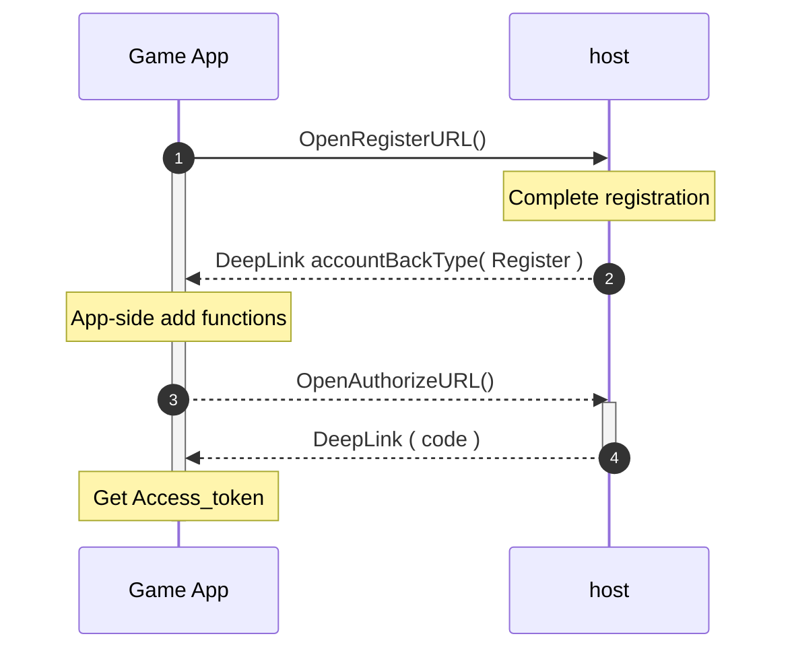
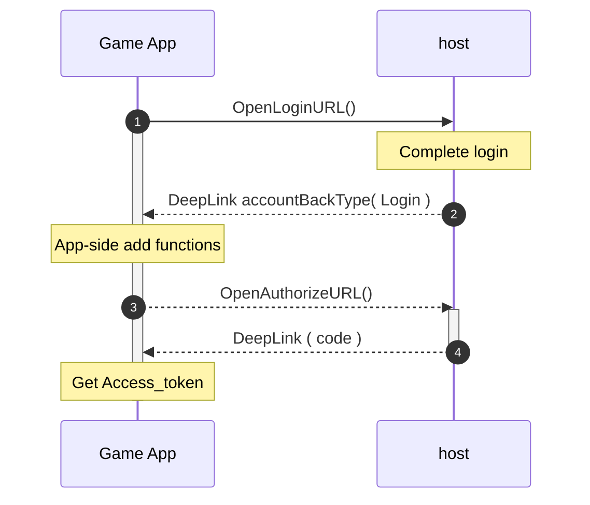
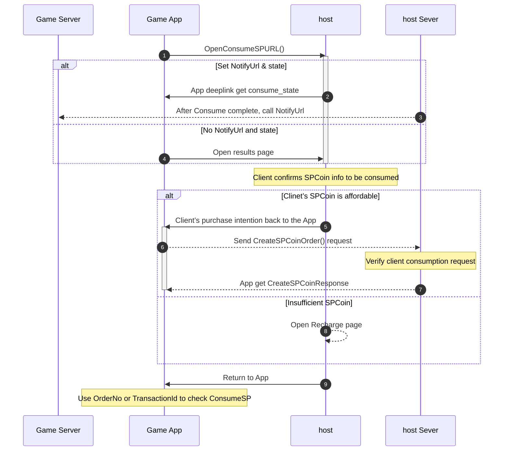

# 17dame Connect Tool for Android 
17dame connect tool: ConnectTool provides registration, login, Authorize,get access token, refresh token and user information. 
## Table of Contents 
- [Installation](#installation) 
- [Setting](#setting)
- [Authorize Flow](#authorize-flow)
- [ConnectTool function](#connecttool-function) 
    - [SendRegisterData](#sendregisterdata)
    - [SendLoginData](#sendlogindata)
    - [OpenRegisterURL, OpenLoginURL ,OpenLogoutURL](#openregisterurl-openloginurl-openlogouturl)
    - [App-side event response (Register, Login, Logout)　](#app-side-event-response-register-login-logout)
    - [OpenAuthorizeURL](#openauthorizeurl)
    - [GetConnectToken_Coroutine](#getconnecttoken_coroutine)
    - [GetRefreshToken_Coroutine](#getrefreshtoken_coroutine)
- [Recharge function](#recharge-function)
    - [Recharge flow](#recharge-flow)  
    - [Open Recharge page](#open-recharge-page)
    - [GetPurchaseOrderList](#getpurchaseorderlist)
    - [GetPurchaseOrderOne](#getpurchaseorderone)
- [ConsumeSP function](#consumesp-function)
    - [ConsumeSP flow](#consumesp-flow)  
    - [Open ConsumeSP page](#open-consumesp-page) 
    - [Create SPCoin Order Api](#create-spcoin-order-api) 
    - [Query ConsumeSP By transactionId](#query-consumesp-by-transactionid)
- [NotifyUrl & State](#notifyurl--state)
    - [Recharge NotifyUrl](#recharge-notifyurl)
    - [ConsumeSP NotifyUrl](#consumesp-notifyurl)
- [Recommended testing process](#recommended-testing-process) 
    - [Generate new account](#generate-new-account)
    - [Switch account](#switch-account)
- [Model](#model) 

## Prerequisites
### Minimum SDK
Your application needs to support minimum SDK version 26. 

## Installation
- Downliad libary:[connecttool-v1.3.1.aar](https://github.com/jianweiCiou/com.17dame.connecttool_android/blob/main/Tutorial/connecttool-v1.3.1.aar)
- Connect Tool AAR Tutorial-v1.3.1.pdf (for Payment): [View](https://github.com/jianweiCiou/com.17dame.connecttool_android/blob/main/Tutorial/Connect%20Tool%20AAR%20Tutorial-v1.3.1.pdf)

- Downliad libary:[connecttool-v1.0.0.aar](https://github.com/jianweiCiou/com.17dame.connecttool_android/blob/main/Tutorial/connecttool-v1.0.0.aar)
- Connect Tool AAR Tutorial-v1.0.0.pdf (for Authorize): [View](https://github.com/jianweiCiou/com.17dame.connecttool_android/blob/main/Tutorial/Connect%20Tool%20AAR%20Tutorial-v1.0.0.pdf)
  
## Setting
- Open \app\src\main\AndroidManifest.xml to add:
```xml
<uses-permission android:name="android.permission.INTERNET" />
``` 
```xml
<intent-filter>
  <action android:name="android.intent.action.VIEW" />
  <category android:name="android.intent.category.DEFAULT" />
  <category android:name="android.intent.category.BROWSABLE" />
  <data android:scheme="{{ Get from redirect_uri's scheme }}" android:host="connectlink" />
</intent-filter>
```  
- redirect_uri : Set the name of the scene to be opened, for example `{{ Get from redirect_uri's scheme }}://connectlink?connectscene`
 
- Add implementation to build.gradle : 
```txt
dependencies { 
   ...
    // post request
    implementation 'com.squareup.retrofit2:retrofit:2.1.0'
    implementation 'com.squareup.retrofit2:converter-gson:2.1.0'
    implementation 'com.squareup.okhttp3:logging-interceptor:3.4.1'
    implementation 'com.squareup.okhttp3:okhttp:3.4.1'

    implementation(project(":connecttool"))
}
```

## Authorize Flow
Here is a simple flow chart:

 
Send Authorize to get access_token and get code:
```java 
Intent appLinkIntent = getIntent();
String appLinkAction = appLinkIntent.getAction();
Uri appLinkData = appLinkIntent.getData(); 
if (appLinkData != null && appLinkData.isHierarchical()) {
 String uri = this.getIntent().getDataString();
 _connectTool.code = appLinkData.getQueryParameter("code");
}
```


## ConnectTool function
- Create `ConnectTool` and `ConnectTool.ConnectBasic`, parameters must be filled in:
```csharp
_connectTool = new ConnectTool(
  this,
  state,
  requestNumber,
  redirect_uri,
  RSAstr
); 
_connectTool.connectBasic = new ConnectBasic()
{
    client_id,
    X_Developer_Id,
    client_secret,
    Game_id,
    referralCode,
};
```
- state : Please fill in what you want to verify,`state` can be query through redirect_uri.
- requestNumber :The identification generated by game developer, It must be Universally Unique Identifier (UUID) format.

     
### SendRegisterData　
- Create ConnectTool.CreateAccountInitData object first.
```csharp  
_connectTool.CreateAccountInitData(_email,_password);
```
- `email`,`Password` are required.
> [!IMPORTANT]  
> - Password must have at least one `uppercase letter`/`lowercase letter`/`symbol`. (i.e., Zy-11111) 
> - Password length must be 6 or more.
- Send ConnectTool.SendRegisterData().
- Return StatusCode check.
  
### SendLoginData　
- Create ConnectTool.CreateAccountInitData object first; 
```csharp  
_connectTool.CreateAccountInitData(_email,_password);
```
- `email`,`Password` are required.

  Must have at least one  `uppercase letter`/`lowercase letter`/`symbol`
  
- Send ConnectTool.SendLoginData().
- Return StatusCode check.

### OpenRegisterURL, OpenLoginURL ,OpenLogoutURL　
Open the host page, perform registration, login and logout
```java
// Register
Register_pageButton.setOnClickListener(view -> {
_connectTool.OpenRegisterURL();
});
// Login
Login_pageButton.setOnClickListener(view -> {
_connectTool.OpenLoginURL();
});
// Logout
LogoutButton.setOnClickListener(view -> {
	_connectTool.OpenLogoutURL();
});
``` 
### App-side event response (Register, Login, Logout)　
```java
if (appLinkData.getQueryParameterNames().contains("accountBackType")) {
	String accountBackType = appLinkData.getQueryParameter("accountBackType");
	if(accountBackType.equals("Register")){
		/*
		* App-side add functions.
		*/ 
	}
	if(accountBackType.equals("Login")){
		/*
		* App-side add functions.
		*/ 
	}
	if(accountBackType.equals("Logout")){
		/*
		* App-side add functions.
		*/
	}
        _connectTool.AccountPageEvent(accountBackType);
}
```
#### Register event response

#### Login event response


#### Logout event response

  
 
### OpenAuthorizeURL　 
- `connectBasic.client_id` is required. 
- Open host page to log in.
- You will get `code` from redirect_uri's parameter after logs in.

```java  
// deepLink
Intent appLinkIntent = getIntent();
String appLinkAction = appLinkIntent.getAction();
Uri appLinkData = appLinkIntent.getData();
if (appLinkData != null && appLinkData.isHierarchical()) {
	String uri = this.getIntent().getDataString();
	_connectTool.code = appLinkData.getQueryParameter("code");
}
```
Step 
1. Execute Authorize through ConnectTool.
2. Open Login page.
3. Retrieve code through onDeepLinkActivated.
4. Execute GetConnectToken_Coroutine to obtain access_token.

### GetConnectToken_Coroutine 
- `connectTool.code` is required. 
- `connectTool.code` can be obtained through ConnectTool set or onDeepLinkActivated function.
- Return ConnectTokenModel

### GetRefreshToken_Coroutine  
- `connectTool.refresh_token` is required.  
- Return ConnectTokenModel.

### GetMe_Coroutine 
- `connectTool.access_token` is required.  
- Return MeInfo.

 
## Recharge function 

### Recharge flow

1.  After selecting CurrencyCode, open the Recharge page.
2.  Call connectTool.set_purchase_notifyData: Set data to be brought back to App and Server. 
3.  After Payment complete, host will call NotifyUrl automatically.
4.  If NotifyUrl & state are not set, only the results page.
5.  Confirming the purchase item, obtain authorization prime from the third-party payment.
6.  After verifying request, host will receive the prime code.
7.  Bring spCoinItemPriceId into backend to generate tradeNo.
8.  PayWithBindPrime brings prime and tradeNo to the backend and third-party payment, and opens the transaction page.
9.  Bring back transaction results.
10.  Return to App.
    
### Open Recharge page 
Open SP Coin Recharge page. 
```java
String notifyUrl = "";// NotifyUrl is a URL customized by the game developer
String state = "Custom state";// Custom state ,
// Step1. Set notifyUrl and state,
_connectTool.set_purchase_notifyData(notifyUrl, state);

// Step2. Set currencyCode
String currencyCode = "2";

// Step3. Open Recharge Page
_connectTool.OpenRechargeURL(currencyCode, notifyUrl, state);
```
- `notifyUrl` & `state` : Please refer to [NotifyUrl & State](#notifyurl--state)
- `currencyCode` : Please refer to [Currency Code](#currency-code)

#### Currency Code
| Code  | USD |TWD |CNY |JPY |KRW |VND |THB |MYR |SGD |  
| --- | --- |--- |--- |--- |--- |--- |--- |--- |--- |
| key  | 1 |2 |4 |8 |16 |32 |64 |128 |256 |   

#### PayMethods
| Method  | Credit Card |Credit Card(Bind) |Apple Pay |Google Pay | 
| --- | --- |--- |--- |--- | 
| key  | 0 |1 |2 |3 | 

### GetPurchaseOrderList
Get the order list for purchasing SP Coin.
```java
GetPurchaseOrderListButton.setOnClickListener(view -> {
	try {
		_connectTool.GetPurchaseOrderList(new GetPurchaseOrderListCallback() {
			@Override
			public void callback(PurchaseOrderListResponse value) {
				Log.v(TAG, "PurchaseOrderListResponse callback : " + value);
			}
		});
	} catch (NoSuchAlgorithmException e) {
		throw new RuntimeException(e);
	}
});
```
Response :
```json
{
  "data": [
    {
      "payMethod": 0,
      "tradeNo": "PAC2023121400000261",
      "spCoin": 120,
      "rebate": 0,
      "state": "Custom state",
      "notifyUrl": "",
      "sign": null,
      "status": 0,
      "currencyCode": "TWD",
      "totalAmt": 56,
      "createdOn": "2023-12-14T19:17:32.3789489+00:00"
    },
    ...
  ],
  "status": 1000,
  "message": null,
  "detailMessage": null,
  "requestNumber": "3fa85f64-5717-4562-b3fc-2c963f66afa6"
}
```
> [!NOTE]  
> The Response of PurchaseOrderList will not have NotifyUrl and Sign.


### GetPurchaseOrderOne
Get a single SP Coin order via tradeNo.
```java
try {
	String tradeNo = "PAC2023121400000261";
	_connectTool.GetPurchaseOrderOne(new PurchaseOrderCallback() {
		@Override
		public void callback(PurchaseOrderOneResponse value) {
			Log.v(TAG, "PurchaseOrderOneResponse callback : " + value);
		}
	}, tradeNo);
} catch (NoSuchAlgorithmException e) {
	throw new RuntimeException(e);
}
```
Response :
```json
{
  "data": {
    "payMethod": 0,
    "tradeNo": "PAC2023121400000261",
    "spCoin": 120,
    "rebate": 0,
    "state": "Custom state",
    "notifyUrl": "",
    "sign": null,
    "status": 0,
    "currencyCode": "TWD",
    "totalAmt": 56,
    "createdOn": "2023-12-14T19:17:32.3789489+00:00"
  },
  "status": 1000,
  "message": null,
  "detailMessage": null,
  "requestNumber": "3fa85f64-5717-4562-b3fc-2c963f66afa6"
}
```
> [!NOTE]  
> The Response of GetPurchaseOrderOne will not have NotifyUrl and Sign.

## ConsumeSP function
### ConsumeSP flow

1.Prepare the SPcoin value from  App and bring the consumption info to the ConsumeSP page. There is no need to check whether the user's SPCoin is affordable. 
2.If the developer has filled in state, consume_state will be brought back from the ConsumeSP page after the consumption is completed. 
3.If the developer has prepared NotifyUrl, the user's transaction info will be sent from the host server to the Game Server after the consumption is completed.
4.If NotifyUrl and state are not filled in, only the results page will be displayed.
5.If the user can afford the SPCoin value, then press the confirm button and return to App
6.Call the CreateSPCoinOrder() to complete the consumption, and the SPCoin will be deducted after the host server verification.
7.The App obtains CreateSPCoinResponse to confirm the consumption.
8.If the user cannot afford the SPCoin value, the user can open the Recharge page.
9.When consumption is completed, App can query tx by bringing OrderNo or TransactionId into [_connectTool.Get_SPCoin_tx](#query-consumesp-by-transactionid) function.
 

### Open ConsumeSP page  
- To use the SP Coin held by user, please use the createPayment function.
- `consume_spCoin`,`consume_rebate`,`orderNo`,`GameName`,`productName` are required.
- `orderNo` must be unique.
-  Game developers can customize the rules of `orderNo` 
- `GameName` 
- Usage : 
```java  
    String notifyUrl = "";// NotifyUrl is a URL customized by the game developer
    String state = "Custom state";// Custom state ,
    // Step1. Set notifyUrl and state,
    _connectTool.set_purchase_notifyData(notifyUrl, state);

    int consume_spCoin = 50;
    int consume_rebate = 20;
    String orderNo = UUID.randomUUID().toString();
    String GameName = "Good 18 Game";
    String productName = "10 of the best diamonds";
    _connectTool.OpenConsumeSPURL(consume_spCoin, consume_rebate, orderNo, GameName, productName);
```


### Create SPCoin Order Api
- Generate an SPCoin consumption through SDK.
- `spCoin`,`rebate`,`orderNo` are required.
- `orderNo` must be unique.
-  Game developers can customize the rules of `orderNo`
- `connectTool.access_token` is required.  
```java
String notifyUrl = "";// NotifyUrl is a URL customized by the game developer
String state = "Custom state";// Custom state ,

// Step1. Set notifyUrl and state,
_connectTool.set_purchase_notifyData(notifyUrl, state);

int spCoin = 50;
int rebate = 3;
String orderNo = UUID.randomUUID().toString();
_connectTool.CreateSPCoinOrder(new CreatePaymentCallback() {
	@Override
	public void callback(CreateSPCoinResponse value) {
		Log.v(TAG, "CreateSPCoinResponse orderStatus : " + value.data.orderStatus);
	}
}, spCoin, rebate, orderNo);
```

PaymentResponse example :
```json
{
  "data": {
    "transactionId": "T2023121700000042",
    "orderNo": "d8381a5b-2bb9-4f83-944a-d48cdde1fbdb",
    "spCoin": 50,
    "rebate": 3,
    "orderStatus": "Completed",
    "state": "Custom state",
    "notifyUrl": "",
    "sign": "hsGHMFiG5JXyKS5cx+zwZSJ3y8Zd0oYe3Z6hhD7HDAXRXLhsO/DXjPyzd4XnMUcv8h7kpmFLfFtIZ8PyMlw7lSXjK9vwVp1gArOUH9uF7z3m0cfgYl+4V9/BjdgQOKIvthoINPLf716EXykC6WPdjvROon+/LtA7FhCwTgttSzRjLGOl3n1KYHVXaj9MSqMRrNBc6NFivWJksA30zkFbAMAhhKS3vdMf35A94wYnFKqNbolgv5w6VczAL8hC8zqHAzsw3kzUHqB/fPo/dtIS+NNu5XZ8hUXIkDDJh4DJpvG9gJPxyncZo+NAyiWjMcpOMPOB0qhHfXzz2vfY08f/Fw=="
  },
  "status": 0,
  "message": null,
  "detailMessage": null,
  "requestNumber": "898c153e-69a1-43dd-af19-c02b075e68ab"
}
```
- transactionId : Consumption SP Coin record ID.
- orderStatus(Completed) : Complete SP coin deduction.
- status(0) : Complete SP coin deduction.


### Query ConsumeSP By transactionId 
- Obtain transaction data after consuming SPCoin.
- Retrieve the consumption information through `OrderNo` or `TransactionId`
```java
try {
	String transactionId = "T2023121500000030";

	_connectTool.Get_SPCoin_tx(transactionId,new GetSPCoinTxCallback() {
		@Override
		public void callback(SPCoinTxResponse value) {
			Log.v(TAG, "SPCoinTxResponse callback : " + value.status);
		}
	});
} catch (NoSuchAlgorithmException e) {
	throw new RuntimeException(e);
}
```
	
Response body:
``` JSON
{
  "data": {
    "transactionId": "T2023121500000030",
    "orderNo": "b427a826-4101-4172-8694-9e0ee868b9ab",
    "spCoin": 50,
    "rebate": 3,
    "orderStatus": "Completed",
    "state": "Custom state",
    "notifyUrl": null,
    "sign": null
  },
  "status": 1000,
  "message": null,
  "detailMessage": null,
  "requestNumber": "ebe4ae28-dda1-499d-bdbc-1066ce080a6f"
}
```
 

#### OrderStatuses
| Failed  | WaitingForPayment |Processing |Completed |Refund |Cancel |PaymentExpired | 
| --- | --- |--- |--- |--- |  --- | --- | 
 
 
## NotifyUrl & State
> [!NOTE]  
> - notifyUrl :NotifyUrl is a URL customized by the game developer. We will post NotifyUrl automatically when the purchase is completed.
> - state : State is customized by game developer, which will be returned to game app after purchase complete. (Deeplink QueryParameter => `purchase_state`)

### Recharge NotifyUrl
#### Recharge NotifyUrl response.body : 
``` JSON
{
  "PayMethod": 3, 
  "TradeNo": "PAC2023121400000245",
  "SPCoin": 1160,
  "Rebate": 40,
  "State": "M1 State_GooglePay",
  "NotifyUrl": "https://localhost:7109/ACPayNotify/TradeNotify",
  "Sign": "KxWFrnWPGquIAC/Pt1WPvX5operr5uHaPWG2YP8X28e6nLalfLCTZlq+liXijWrcJo1Ha9JzMC+9VbcZeG3pcin63xoBkKfEtdV9QbnT6pnxXH+pS8pEWNmQIQKKkDrxjkMZ3OjcY/CC9TW+mDURCYj8vu8EHB9zDJ1sGOP7y4o2aNRa+ZK/SxC9eZKV5l6P7Y/iv88DH7wiTbQ5qVw5FhwJLuqfi3gCOn4aVsmjc270jU9mP6TgdTUo5y2FHtYXAbsQP/07h2gJeTwQf/nO6gHVs3Ur8/t3hHtIwqCGBNQl6/TYwf6rSXRdMoBUjdLGm5GpBA5Pq7mzBqYI3UDheg==",
  "Status": 2,
  "CurrencyCode": "TWD",
  "TotalAmt": 545.0000,
  "CreatedOn": "2023-12-14T07:13:19.0375746+00:00"
}
```

#### Encrypted Recharge content (No "Sign" string): 
``` JSON
{
  "PayMethod": 3,
  "TradeNo": "PAC2023121400000245",
  "SPCoin": 1160,
  "Rebate": 40,
  "State": "M1 State_GooglePay",
  "NotifyUrl": "https://localhost:7109/ACPayNotify/TradeNotify",
  "Status": 2,
  "CurrencyCode": "TWD",
  "TotalAmt": 545.0000,
  "CreatedOn": "2023-12-14T07:13:19.0375746+00:00"
} 
```

#### Create "Sign" to verify: 
privateKey : Use RSAstr as privateKey.
```JavaScript
 var rsa = RSA.Create();
  rsa.ImportFromPem(privateKey);
  var bytes = Encoding.UTF8.GetBytes(data);
  // sign
  var signature = rsa.SignData(bytes, 0, bytes.Length, HashAlgorithmName.SHA256,RSASignaturePadding.Pkcs1);
  var xSignature = Convert.ToBase64String(signature);
```
### ConsumeSP NotifyUrl
#### ConsumeSP NotifyUrl response.body : 
``` JSON
{
  "TransactionId": "T2023121400000021",
  "SPCoin": 10,
  "Rebate": 10,
  "OrderStatus": 3,
  "State": "M13 Order",
  "NotifyUrl": "https://localhost:7109/ACPayNotify/TradeNotify",
  "Sign": "gMq6sjIVFNZfv+NU/V477x8apy1flFiReyuEfR6gUT0FCWjEDRnmTG1hYwJW+vyYOhtxTNC8T+P2IMz/WNCzH5rIN6wlJ+uvh0/15V9ZujFSUeCzVQbKaJ+MTK5KUXErX2sv7JQvnu0C+k0b43rzgjgRr3XyiHcZnzv3/r683vO0HdBkIX18LHO9uPEJTk3Bbwd5+twc1G6TXToEEf/Vkb6hOd7FpGXp61ljHkIi4HeLPS1FAHdOaJHcFkpTGIF4Ilrbb/IiQSlAGP4R6VclT50hpEXIWtN89ztR8+VnHfTmK27oPyKwDoO1dXZ8EmwB8zxG/ilNIERN+bmP2lcDnw=="
}
```

#### Encrypted ConsumeSP content (No "Sign" string): 
``` JSON
{
  "TransactionId": "T2023121400000021",
  "SPCoin": 10,
  "Rebate": 10,
  "OrderStatus": 3,
  "State": "M13 Order",
  "NotifyUrl": "https://localhost:7109/ACPayNotify/TradeNotify"
}
```
- Create "Sign" to verify : Please refer to [Create sign to verify](#create-sign-to-verify)
## Recommended testing process
### Generate new account:
1. Press the <kbd> <br> Logout Link <br> </kbd> button  
2. Press the <kbd> <br> Register Link <br> </kbd> button
3. Enter new account information
4. Press the <kbd> <br> Authorize <br> </kbd> button
5. Press <kbd> <br> Recharge Link<br> </kbd>, Open the Recharge page and confirm that SP Coin is 0

### Switch account:
1. Press the <kbd> <br> Logout Link <br> </kbd> button
2. Press the <kbd> <br> Authorize <br> </kbd> button
3. Enter the account you want to use
4. Press the <kbd> <br> Authorize <br> </kbd> button
5. Press <kbd> <br> Recharge Link<br> </kbd>, and complete the recharge
6. Press <kbd> <br> Consume SP Link<br> </kbd>,Open the consumption page and complete the consumption

## Model 


## License
Android Utlity SDK is licensed with the MIT License. For more details, see LICENSE.


