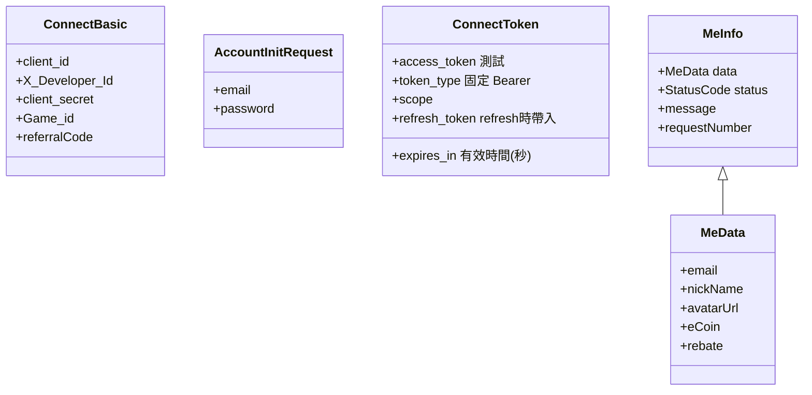

# 17dame Connect Tool for Android 
17dame connect tool: ConnectTool provides registration, login, Authorize,get access token, refresh token and user information. 
## Table of Contents 
- [Installation](#installation) 
- [Setting](#setting)
- [Flow](#operating)
- [ConnectTool function](#function) 
    - [SendRegisterData](#SendRegisterData)
    - [SendLoginData](#SendLoginData)
    - [OpenAuthorizeURL](#OpenAuthorizeURL)
    - [GetConnectToken_Coroutine](#GetConnectToken_Coroutine)
    - [GetRefreshToken_Coroutine](#GetRefreshToken_Coroutine)  
- [Model](#model) 

## Prerequisites
### Minimum SDK
Your application needs to support minimum SDK version 22. 

## Installation
- Downliad libary:[connecttool.aar](https://github.com/jianweiCiou/com.17dame.connecttool_android/blob/main/Tutorial/connecttool.aar)
- Connect Tool AAR Tutorial-v1.0.0.pdf : [View](https://github.com/jianweiCiou/com.17dame.connecttool_android/blob/main/Tutorial/Connect%20Tool%20AAR%20Tutorial-v1.0.0.pdf)
  
## Setting
- Open \app\src\main\AndroidManifest.xml to add:
```xml
<uses-permission android:name="android.permission.INTERNET" />
```
```xml
<intent-filter>
  <action android:name="android.intent.action.VIEW" />
  <category android:name="android.intent.category.DEFAULT" />
  <category android:name="android.intent.category.BROWSABLE" />
  <data android:scheme="{{ Get from redirect_uri's scheme }}" android:host="connectlink" />
</intent-filter>
```  
- redirect_uri : Set the name of the scene to be opened, for example `{{ Get from redirect_uri's scheme }}://connectlink?connectscene`
 
- Add implementation to build.gradle : 
```txt
dependencies { 
   ... 
    implementation(project(":connecttool"))
}
```

## Flow
Here is a simple flow chart:

 
Send Authorize to get access_token and get code:
```java 
Intent appLinkIntent = getIntent();
String appLinkAction = appLinkIntent.getAction();
Uri appLinkData = appLinkIntent.getData(); 
if (appLinkData != null && appLinkData.isHierarchical()) {
 String uri = this.getIntent().getDataString();
 _connectTool.code = appLinkData.getQueryParameter("code");
}
```


## ConnectTool function
- Create `ConnectTool` and `ConnectTool.ConnectBasic`, parameters must be filled in:
```csharp
_connectTool = new ConnectTool(
  this,
  state,
  requestNumber,
  redirect_uri,
  RSAstr
); 
_connectTool.connectBasic = new ConnectBasic()
{
    client_id,
    X_Developer_Id,
    client_secret,
    Game_id,
    referralCode,
};
```
- state : Please fill in what you want to verify,`state` can be query through redirect_uri.
- requestNumber :The identification generated by game developer, It must be Universally Unique Identifier (UUID) format.

     
### SendRegisterData　
- Create ConnectTool.CreateAccountInitData object first.
```csharp  
_connectTool.CreateAccountInitData(_email,_password);
```
- `email`,`Password` are required.
> [!IMPORTANT]  
> - Password must have at least one `uppercase letter`/`lowercase letter`/`symbol`. (exp: Zy-11111) 
> - Password length must be 6 or more.
- Send ConnectTool.SendRegisterData().
- Return StatusCode check.
  
### SendLoginData　
- Create ConnectTool.CreateAccountInitData object first; 
```csharp  
_connectTool.CreateAccountInitData(_email,_password);
```
- `email`,`Password` are required.

  Must have at least one  `uppercase letter`/`lowercase letter`/`symbol`
  
- Send ConnectTool.SendLoginData().
- Return StatusCode check.

### OpenAuthorizeURL　 
- `connectBasic.client_id` is required. 
- Open host page to log in.
- You will get `code` from redirect_uri's parameter after logs in.

```java  
            // deepLink
            Intent appLinkIntent = getIntent();
            String appLinkAction = appLinkIntent.getAction();
            Uri appLinkData = appLinkIntent.getData();
            if (appLinkData != null && appLinkData.isHierarchical()) {
                String uri = this.getIntent().getDataString();
                _connectTool.code = appLinkData.getQueryParameter("code");
            }
```
Step 
1. Execute Authorize through ConnectTool.
2. Open Login page.
3. Retrieve code through onDeepLinkActivated.
4. Execute GetConnectToken_Coroutine to obtain access_token.
### GetConnectToken_Coroutine 
- `connectTool.code` is required. 
- `connectTool.code` can be obtained through ConnectTool set or onDeepLinkActivated function.
- Return ConnectTokenModel

### GetRefreshToken_Coroutine  
- `connectTool.refresh_token` is required.  
- Return ConnectTokenModel.

### GetMe_Coroutine 
- `connectTool.access_token` is required.  
- Return MeInfo.


## Model 


## License
Android Utlity SDK is licensed with the MIT License. For more details, see LICENSE.


